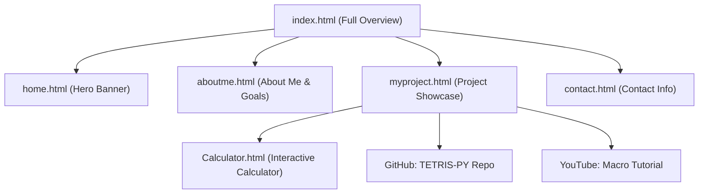

# 🌐 MultiplePage - Personal Portfolio Website

[](https://developer.mozilla.org/en-US/docs/Web/HTML)
[](https://developer.mozilla.org/en-US/docs/Web/CSS)
[](https://developer.mozilla.org/en-US/docs/Web/JavaScript)
[](LICENSE)

A modern, responsive, multi-page personal portfolio web application created by **Faqih Rachman**. Designed to highlight software programming projects, student profile, learning philosophy, interactive web tools, and direct contact avenues with clean design and smooth user interactions.

---

## 📌 Table of Contents

- [Overview](#-overview)
- [Architecture & Multi-Page Routing](#-architecture--multi-page-routing)
- [Key Pages & Sections](#-key-pages--sections)
- [Featured Projects](#-featured-projects)
- [Tech Stack & Assets](#-tech-stack--assets)
- [Project Structure](#-project-structure)
- [Getting Started / Local Setup](#-getting-started--local-setup)
- [Key Features & User Experience](#-key-features--user-experience)
- [Author & Contact](#-author--contact)

---

## 🚀 Overview

The **MultiplePage** web project provides both a **unified single-page experience** (`index.html`) and a **modular multi-page structure** (`home.html`, `aboutme.html`, `myproject.html`, `contact.html`, and `Calculator.html`). 

It serves as a personal brand website showcasing:
- **Developer Background & Objectives**: Software programming enthusiast sharing learning goals.
- **Interactive Web Applications**: A standalone web calculator built with vanilla JavaScript.
- **External Software & Media**: Game development projects (Python Tetris) and video content (Roblox Macro Tutorial).
- **Direct Communication Tools**: Clickable phone dialing, email links, and interactive map locations.

---

## 🗺️ Architecture & Multi-Page Routing

The site utilizes standard static file routing where each main section has a dedicated standalone page as well as being aggregated into the index page for maximum accessibility.



| Page File | Description | Route Purpose |
| :--- | :--- | :--- |
| `index.html` | Comprehensive single page aggregating all portfolio sections | Main Landing & Unified Experience |
| `home.html` | Dedicated Hero banner page with dynamic introduction | Focused Welcome View |
| `aboutme.html` | Personal bio, learning philosophy, and student goals | Personal Background & Objectives |
| `myproject.html` | Project portfolio grid with descriptions and links | Featured Work & Demonstrations |
| `contact.html` | Contact channels (Phone, Email, Address link) | Direct Messaging & Outreach |
| `Calculator.html` | Standalone interactive dark-mode web calculator tool | Web Application Demo |

---

## ✨ Key Pages & Sections

### 1. 🏠 Hero Section (`home.html` & Header)
- **Dynamic Brand Header**: Displays brand logo and custom typography (`Faqih Rachman`).
- **Responsive Navigation Bar**: Includes links to all pages and a mobile-friendly animated hamburger menu.
- **Hero Banner**: High-impact welcome message backed by a styled background image overlay (`hero-bg.jpeg`) and Call-to-Action (CTA) button.

### 2. 👨‍💻 About Me (`aboutme.html`)
- **Personal Background**: Introduces Faqih Rachman as a Software Programming student passionate about coding and continuous learning.
- **Lifelong Learning Philosophy**: Highlights adaptability and eagerness to tackle new technical challenges.
- **Objectives & Goals**: Focuses on community contribution and software skill refinement.

### 3. 📂 Projects Showcase (`myproject.html`)
Presents visual project cards equipped with preview images, concise summaries, and action links:
- **Simple Calculator**: In-browser calculation application (`Calculator.html`).
- **Tetris PY**: Classic Tetris game engine written in Python Pygame.
- **Roblox Macro Tutorial**: Video walkthrough guide hosted on YouTube.

### 4. 🧮 Standalone Web Calculator (`Calculator.html`)
- **Modern Dark Interface**: Styled using HSL color palette with contrast operator buttons.
- **Functionality**: Standard arithmetic operations (`+`, `-`, `*`, `/`), decimal support, display clear (`C`), and calculation execution.

### 5. 📞 Contact Information (`contact.html`)
- **Phone**: Instant mobile dialing via `tel:+6285210105483`.
- **Email**: Direct email client trigger via `mailto:faqihrachman02@gmail.com`.
- **Address**: Location navigation linking directly to Google Maps.

---

## 🛠️ Tech Stack & Assets

| Category | Technologies / Resources Used |
| :--- | :--- |
| **Frontend Core** | HTML5, CSS3, JavaScript (ES6+ Vanilla JS) |
| **Typography** | Google Fonts (`Montserrat`: 300, 400, 700) |
| **Icons & Media** | Icons8 Bubble Icon Set, Custom JPEG/PNG Assets |
| **Styling & Layout** | CSS Flexbox, Grid, Media Queries, CSS Transitions |
| **Interactivity** | Mobile Hamburger Menu, Dynamic Scroll Header background change (`app.js`), Calculation Logic (`calculator.js`) |
| **External Tech** | Python & Pygame (Referenced in Tetris PY) |

---

## 📁 Project Structure

```
MultiplePage/
│
├── index.html                      # Primary landing page (combines all sections)
├── home.html                       # Standalone Home / Hero page
├── aboutme.html                    # Standalone About Me section
├── myproject.html                  # Standalone Projects showcase page
├── contact.html                    # Standalone Contact Information page
├── Calculator.html                 # Interactive Web Calculator app
│
├── app.js                          # UI logic: Hamburger menu & dynamic scroll header
├── calculator.js                   # Web calculator logic & expression evaluator
├── style.css                       # Main stylesheet (Design tokens, layouts, responsive rules)
├── styles.css                      # Calculator-specific CSS styles
│
├── hero-bg.jpeg                    # High-res background image for Hero section
├── calculator.jpg                  # Project thumbnail: Simple Calculator
├── tetris.jpg                      # Project thumbnail: Tetris PY
├── Roblox.jpg                      # Project thumbnail: Roblox Macro Tutorial
├── Screenshot 2025-08-11 212553.png # Brand logo asset
└── README.md                       # Documentation
```

---

## 💻 Getting Started / Local Setup

No build tools or server setup required! You can open and view the website directly in any web browser.

### Option 1: Direct File Opening
1. Clone or download this repository to your local computer:
   ```bash
   git clone https://github.com/Kuronami089/MultiplePage.git
   ```
2. Navigate into the repository directory:
   ```bash
   cd MultiplePage
   ```
3. Double click on `index.html` (or any `.html` file) to open it in your browser.

### Option 2: Local HTTP Server (VS Code / Node.js)
If using VS Code with **Live Server**:
1. Open the project folder in VS Code.
2. Right-click `index.html` and select **Open with Live Server**.

Or using `npx`:
```bash
npx serve .
```

---

## 🌟 Key Features & User Experience

- 📱 **Fully Responsive Design**: Optimized for desktop, tablet, and mobile devices using CSS media queries.
- 🍔 **Mobile Hamburger Menu**: Interactive toggle drawer for seamless navigation on smaller screens.
- 🎨 **Unified Design System**: Cohesive color palette utilizing crimson accents, dark headers (`#1a1a1a`), and smooth hover states.
- 📜 **Scroll Interactivity**: Header transition dynamically alters background opacity and color upon scrolling past 250px.
- 🧮 **Interactive Calculator Tool**: Built-in utility application demonstrates practical DOM manipulation and event handling.

---

## ✉️ Author & Contact

**Faqih Rachman**  
*Software Programming Student & Web Developer*

- 📧 **Email**: [faqihrachman02@gmail.com](mailto:faqihrachman02@gmail.com)
- 📞 **Phone**: [+62 852 1010 5483](tel:+6285210105483)
- 📍 **Location**: [Jln. Buaran Timur No. 2, Indonesia](https://maps.app.goo.gl/W5EzzknSGLQirusx8)
- 🐙 **GitHub**: [@Kuronami089](https://github.com/Kuronami089)

---
*Copyright © 2020 - Present Faqih Rachman. All rights reserved.*